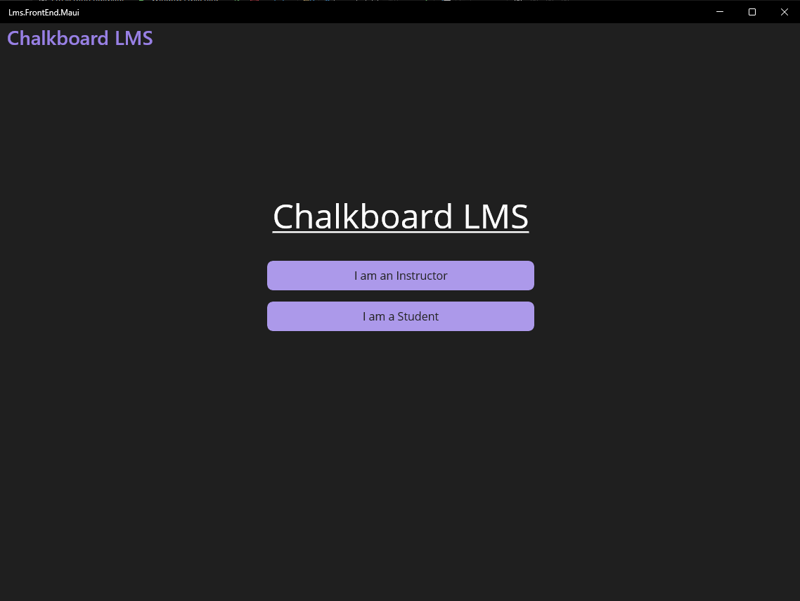
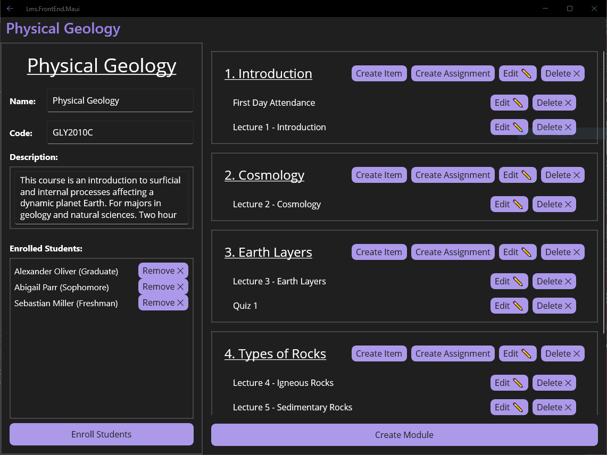

# Chalkboard LMS
**Chalkboard LMS** is a full-stack Learning Management System (like Canvas or Blackboard) written in C# using .NET MAUI, ASP.NET Web API, and MySQL. It allows for creating, reading, updating, and deleting courses, students, enrollments, course modules, course items, course assignments, and submitting/grading assignments.

This project was created for my Full-Stack Application Development with C# (COP4870) class in the Spring 2024 semester.

## Running
As the project is a full-stack application, it has three parts to run.

### MySQL
There needs to be a MySQL server running to connect to. You can download the [MySQL Community Server](https://dev.mysql.com/downloads/mysql/) to run a MySQL server on your local computer.

The root username and password can be configured in [appsettings.json](Lms.BackEnd.WebApi/appsettings.json).

The MySQL server must have a schema `lms` with all the required tables created before running the rest of the application. A [generate.sql](Lms.BackEnd.WebApi/generate.sql) script is provided for your convenience.

### ASP.NET Web API
Once your MySQL server is working, you can run the run configuration `Lms.BackEnd.WebApi`. This requires at least the `.NET desktop development` Visual Studio workload to be installed.

When ran, it should open a Swagger Web UI for viewing and testing all the available REST API endpoints. This run configuration must be running for the .NET MAUI frontend to connect to the MySQL database.

### .NET MAUI
Finally, the .NET MAUI front end can be ran using the `Lms.FrontEnd.Maui` run configuration. This requires at least the `.NET Multi-platform App UI development` Visual Studio workload to be installed.
